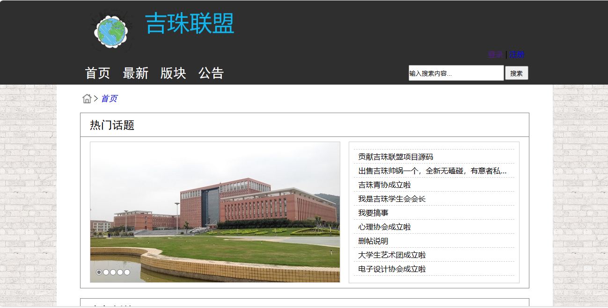
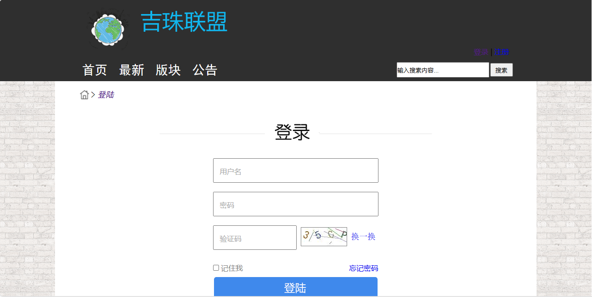
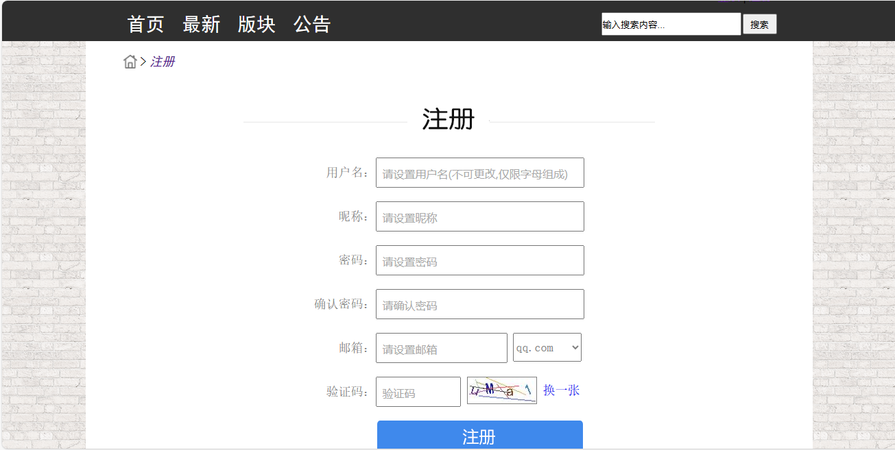
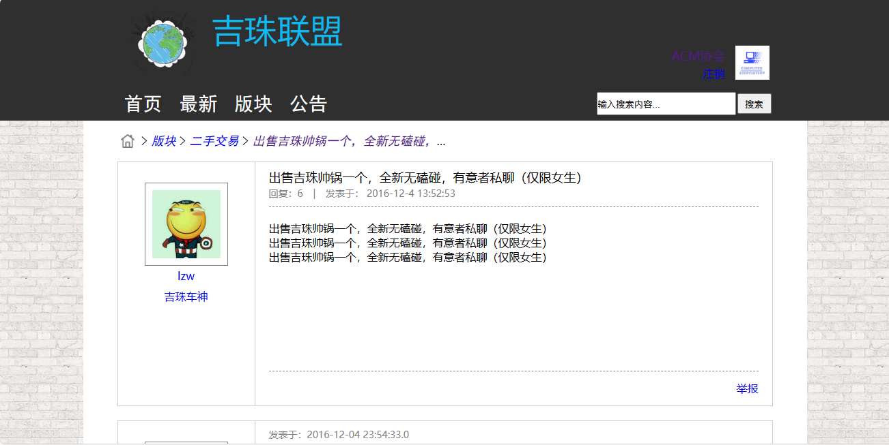
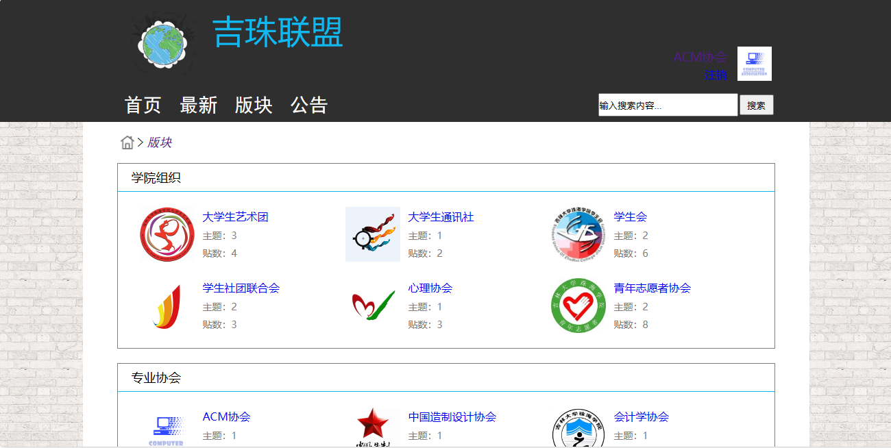
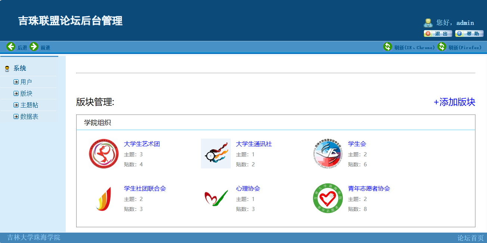
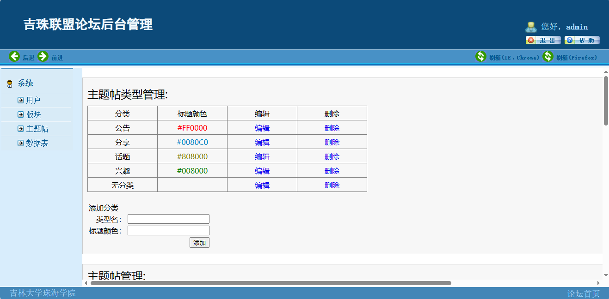

<h1 align="center">学校论坛系统</h1>

- <b>完整代码获取地址：从戎源码网 ([https://armycodes.com/](https://armycodes.com/))</b>
- <b>技术探讨、资料分享，请加QQ群：692619798</b> 
- <b>作者微信：19941326836  QQ：952045282</b> 
- <b>承接计算机毕业设计、Java毕业设计、Python毕业设计、深度学习、机器学习</b>
- <b>选题+开题报告+任务书+程序定制+安装调试+论文+答辩ppt 一条龙服务</b>
- <b>所有选题地址 ([https://github.com/YuLin-Coder/AllProjectCatalog](https://github.com/YuLin-Coder/AllProjectCatalog)) </b>
## 项目介绍

学校论坛系统，前端 Jsp、Jquery，后端 Servlet，论坛系统包括用户端和管理员端，管理员维护讨论板块，关联学院组织和协会，管理员有权删除不合规的主题贴，用户选择合适的板块后，选择帖子主题进行新帖发布；主要功能如下：

### 管理员：

- 用户管理：用户信息从用户端页面注册而来，对用户信息编辑、用户删除、用户主题帖管理、用户回复
- 版本管理：板块分类列表、板块分类添加、板块分类编辑、版块分类删除、添加板块、编辑板块、删除板块
- 主题帖：主题帖类型列表、主题帖类型添加、主题帖类型编辑、主题帖类型删除、主题帖详情查看、主题帖修改、主题贴删除
- 数据表：数据库表列表展示、数据库表记录展示
- 
### 用户：

- 基本操作：登录、注册、修改密码、退出、内容搜索
- 首页：热门话题、人气板块
- 最新：最新帖子展示、帖子查看、主题回复
- 板块：板块展示、发布新帖
- 公告：公告详情展示

## 环境

- <b>IntelliJ IDEA 2009.3</b>

- <b>Mysql 5.7.26</b>

- <b>Tomcat 7.0.73</b>

- <b>JDK 1.8</b>

## 缩略图

